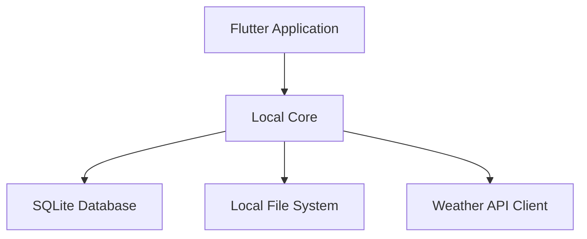

# Architecture Overview

This document provides a high-level overview of Plantarium's technical architecture, explaining how the application components work together to create a seamless gardening experience.

## System Architecture

### 1. Core Application

#### Flutter Application
- Cross-platform application for desktop and mobile
- Offline-first architecture
- Local data management
- Responsive UI
- Background tasks handling

### 2. Core Features

#### Garden Management
- Garden layout management
- Plant placement and tracking
- Garden state persistence
- Local data storage

#### Plant Database
- Local plant database
- Plant information management
- Companion planting logic
- Search and filtering

#### Weather Integration
- Weather data fetching
- Local weather data caching
- Climate zone calculations
- Weather alerts

#### Calendar Management
- Local task scheduling
- Reminder management
- Event tracking
- Local notifications

#### Journal System
- Note management
- Local photo storage
- Activity tracking
- Data backup

### 3. Data Storage

#### Local Database (SQLite)
- Local-first data storage
- Offline data persistence
- Efficient querying
- Data backup and recovery
- Plant database storage
- Garden layouts and configurations
- User preferences and settings
- Journal entries and photos

#### File Storage (Local)
- Local image storage
- Document management
- Backup storage
- Efficient file organization

### 4. External Integration

#### Weather API
- Real-time weather data
- Historical climate data
- Weather alerts
- Forecast information

## Technical Stack

### Application
- **Framework**: Flutter
- **State Management**: Provider
- **Database**: SQLite
- **Storage**: Local File System
- **UI Components**: Material Design/Custom
- **Testing**: Flutter Test

### Local Services
- **Data Management**: SQLite
- **File Handling**: Local File System
- **Background Tasks**: Flutter Background Service
- **Local Cache**: Shared Preferences
- **Events**: Stream Controllers

### External Integration
- **Weather Data**: OpenWeather API (with local caching)
- **Plant Data**: Bundled Database + Updates

### Development Tools
- **Version Control**: Git
- **CI/CD**: GitHub Actions
- **Testing**: Automated Tests
- **Distribution**: Platform Stores
- **Updates**: In-App Updates

## Security

### Data Protection
- Local data encryption
- Secure file storage
- Backup encryption
- Regular security updates

### Authentication
- Local authentication
- Biometric authentication (where available)
- Secure credential storage

## Performance Optimization

### Local Performance
- Efficient database queries
- Image optimization
- Lazy loading
- Background processing

### Storage Management
- Automatic cleanup
- Storage optimization
- Backup management
- Cache control

## Development Workflow

### Version Control
- Git branching strategy
- Pull request reviews
- Automated testing
- Continuous integration

### Deployment
- Platform store distribution
- In-app updates
- Version management
- Release notes

## Maintenance

### Application Updates
- Regular updates
- Security patches
- Feature additions
- Bug fixes

### Data Management
- Database maintenance
- Storage optimization
- Backup procedures
- Data recovery

## Future Plans

### Planned Improvements
1. Enhanced offline capabilities
2. Improved plant database
3. Better weather integration
4. Advanced garden planning tools

### User Experience Goals
1. Faster local operations
2. Better data organization
3. Enhanced search capabilities
4. Improved user interface

## Next Steps

1. [Explore Core Features](../core-features)
2. [View Development Guide](../development/getting-started)
3. [Check User Guide](../user-guide)

---

  
Ready to dive deeper into Plantarium's architecture?

  <a href="../technical" className="button button--primary button--lg">
    Explore Technical Documentation
  </a>

 